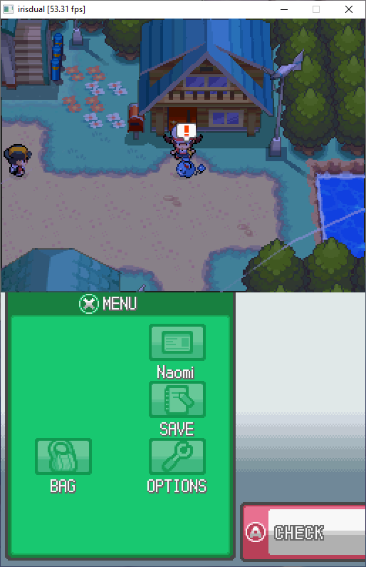

<h2></h2>

A Nintendo DS emulator developed for fun, with performance and multicore CPUs in mind.
A nearly from scratch rewrite of my previous emulator aiming to try new techniques and achieve higher code quality.

**This is highly experimental software.**
I am developing this emulator for fun and learning only.
I do **not** intend to replace any of the established DS emulators.  
**If you are looking for a mature emulator, [melonDS](https://github.com/melonDS-emu/melonDS) is the way to go.**

## Credit
- Martin Korth: for [GBATEK](http://problemkaputt.de/gbatek.htm)
- [Arisotura](https://github.com/Arisotura/): for hardware documentation, especially regarding the 3D engine
- [Hydr8gon](https://github.com/Hydr8gon/): for some hints and sharing 3D engine insights
- [StrikerX3](https://github.com/StrikerX3): for documenting the precise formula for polygon edge interpolation
- [Jaklyy](https://github.com/Jaklyy/): for 3D engine research and sharing her insights

## Copyright

irisdual is Copyright © 2023 fleroviux. All rights reserved. 
irisdual is released under a free for non-commercial use license. Refer to the [LICENSE](LICENSE) file for details.

Nintendo DS is a registered trademark of Nintendo Co., Ltd.
