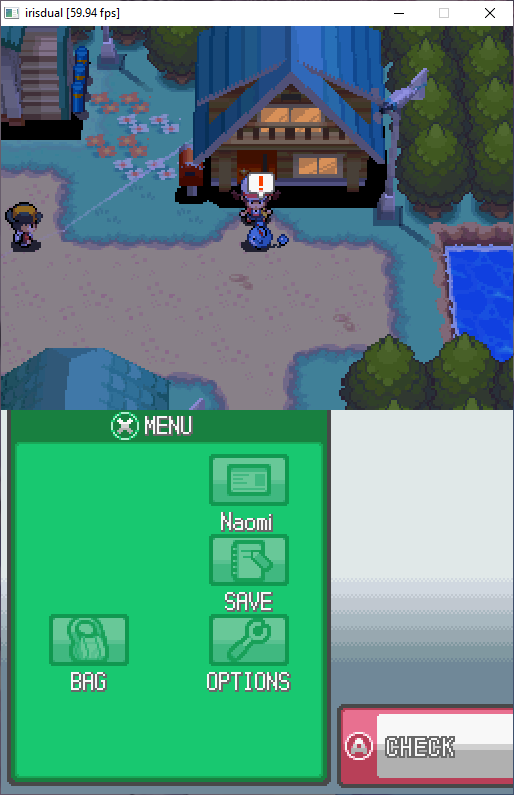

<h2></h2>

A Nintendo DS emulator developed for fun, with performance and multicore CPUs in mind.
A nearly from scratch rewrite of my previous emulator aiming to try new techniques and achieve higher code quality.
However, at the moment not all code has been rewritten yet. But most games and the firmware boot. Notably the JIT is not integrated yet and 3D graphics are promising but work-in-progress.

**This is highly experimental software.**
I am developing this emulator for fun and learning only.
I do **not** intend to replace any of the established DS emulators.  
**If you are looking for a mature emulator, [melonDS](https://github.com/melonDS-emu/melonDS) is the way to go.**

## Copyright

irisdual is Copyright © 2023 fleroviux. All rights reserved. 
irisdual is released under a free for non-commercial use license. Refer to the [LICENSE](LICENSE) file for details.

Nintendo DS is a registered trademark of Nintendo Co., Ltd.
